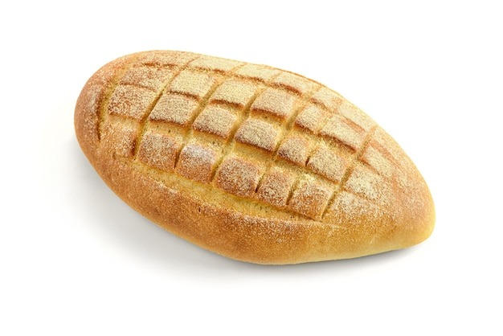

Cosas Extra:

- El diseño es responsivo, por lo que se adapta a diferentes tamaños de pantalla.
- Se hizo los diseños de los productos de manera que se pudieran añadir más sin tener que modificar el código.
- El navegador es así, para que si se añaden nuevos productos simplemente se añada uno nuevo a la lista de productos.

SE PIDE: 
Realizar una clasificación de todos los elementos mencionados en el enunciado según sean: elementos de identificación, navegación, contenido o interacción. 
RESPUESTA
- Elementos de identificación:
  - Logo
  - Nombre de la panadería
- Elementos de navegación:
  - Menú de navegación (Productos, Idioma)
  - Enlaces a diferentes secciones (Panadería, Pastelería, Empanadas)
- Elementos de contenido:
  - Descripción de la panadería
  - Información de contacto (dirección, teléfono)
  - Fotografías de los productos
  - Descripciones de los productos
- Elementos de interacción:
  - Botones del carrusel (Anterior, Siguiente)
  - Enlaces a redes sociales

Indica cuál es el tipo de estructura de navegación más adecuado y explica el motivo. 
RESPUESTA
- La estructura de navegación más adecuada es una barra de navegación fija en la parte superior de la página. Esto permite a los usuarios acceder fácilmente a las diferentes secciones del sitio web sin tener que desplazarse hacia arriba o hacia abajo. Además, la inclusión de menús desplegables para los productos y el idioma mejora la usabilidad y la experiencia del usuario.

Elabora una guía de estilos indicando toda la información que debería figurar en función de los elementos que se han mencionado en el enunciado. 
RESPUESTA
Guía de estilos de… 
Migas Amigas 

Guía de estilos para web 

Líneas generales del diseño online:
- Colores:
  - Color primario: #f5deb3 (Wheat)
  - Color secundario: #d2691e (Chocolate)
  - Color de acento: #ffebcd (Blanched Almond)
  - Color de fondo: #fffaf0 (Floral White)
  - Color de texto: #333 (Dark Gray)

  Usé colores pasteles para darle un aspecto cálido y acogedor al sitio web.

- Tipografía:
  - Fuente principal: 'Noto Color Emoji', 'Roboto', sans-serif
  - Tamaños de fuente:
    - Títulos: 2em
    - Subtítulos: 1.5em
    - Texto normal: 1em
    - Texto pequeño: 0.875em

  Usé la fuente 'Roboto' porque es fácil de leer y se ve bien en pantallas digitales.
  Además usé 'Noto Color Emoji' para que siempre se vieran de manera igual los emojis de la web.

- Estilos de botones:
  - Fondo: var(--primary-color)
  - Color de texto: var(--text-color)
  - Bordes: ninguno
  - Bordes redondeados: 5px
  - Efecto hover: fondo var(--secondary-color), color var(--accent-color)

  Usé botones sin bordes para darle un aspecto más moderno y limpio al sitio web.

- Imágenes:
  - Bordes redondeados: 10px
  - Efecto hover: escala 1.05
  - Logo:
  
  - Imagnes para el carrousel:
       

  - Productos:
    - Empanadas:
       

    - Panadería:
             

    - Pastelería:
           

  - Iconos:
    - Redes sociales:
      

  Usé bordes redondeados en las imágenes para darles un aspecto más suave y amigable.

- Enlaces:
  - Sin subrayado
  - Color de texto: var(--text-color)
  - Efecto hover: fondo var(--accent-color)

  Usé enlaces sin subrayado para que se vean más limpios y modernos.
  Además el logo de la web, es un enlace al inicio de su mismo idioma.

- Carrusel:
  - Botones de navegación: fondo var(--primary-color), color var(--text-color), bordes redondeados 5px
  - Efecto hover en botones: fondo var(--secondary-color), color var(--accent-color)

  Usé botones de navegación con bordes redondeados para que se vean más amigables y fáciles de usar.

- Footer:
  - Fondo: var(--secondary-color)
  - Color de texto: var(--text-color)
  - Enlaces: sin subrayado, color var(--text-color), efecto hover: fondo var(--primary-color)

  Usé un fondo de color secundario en el footer para que se destaque y sea fácil de encontrar.
  Además añadi 3 seciones:
    - Redes Sociales -> Son iconos enlace a las redes sociales de MigasAmigas.
    - Copyright -> Muestra el copyright de la web.
    - Contacto -> En ella puedes ir a la pagina de contacto

Empleando el XHTML. Codifica la estructura de tu página principal empleando tablas. 
RESPUESTA

  La estructura del proyecto es la siguiente:

  MigasAmigas/
    css/
      contact.css -> Esta es la hoja de estilo de la pagina de contacto.
      products.css -> Esta es la hoja de estilo de todos los productos (panadería, pastelería, empanadas).
      style.css -> Esta es la hoja de estilo de todos los inicios (index, ES/index, PT/index).
    
    js/
      script.js -> Este se encarga exclusivamente del carrousel de las paginas de Inicio.

    img/
      logo.png -> Logo principal de la pagina.
      inicio/ -> Aquí se encuentran todas las imagenes del inicio (Carrousel).
      products/ -> Aquí se encuentran todas las imagenes de los productos.
        empanadas/
        panaderia/
        pasteleria/
      redes/ -> Aquí se encuentran todos los iconos de las redes sociales de MigasAmigas.

    PT/ -> Esto es el directorio para el Idioma (Portugués)
      index.html -> Pagina de Inicio.
      contacto.html -> Pagina de Contacto.
      panaderia.html -> Pagina de Panadería.
      pasteleria.html -> Pagina de Pastelería.
      empanadas.html -> Pagina de Empanadas.
    ES/ -> Esto es el directorio para el Idioma (Castellano)
      index.html -> Pagina de Inicio.
      contacto.html -> Pagina de Contacto.
      panaderia.html -> Pagina de Panadería.
      pasteleria.html -> Pagina de Pastelería.
      empanadas.html -> Pagina de Empanadas.

    index.html -> Pagina de Inicio por defecto (Castellano).
    README.md -> Este mismo fichero.

    ¿Por qué he hecho esto así?

    Yo creo que la organización, es correcta para el tamaño del proyecto, podría ser más exaustiva, pero como tampoco era tan grande el proyecto creo que así es más eficiente a la hora de trbajar con las rutas.

    Tuve que "duplicar" el archivo de Inicio para el castellano, puesto que si no las rutas se volvían una completa locura a la hora de tener que hacer redirecciones.

    Desde todas las paginas puedes cambiar de idioma y te manda a la misma pagina en la que estás pero con el idioma cambiado.