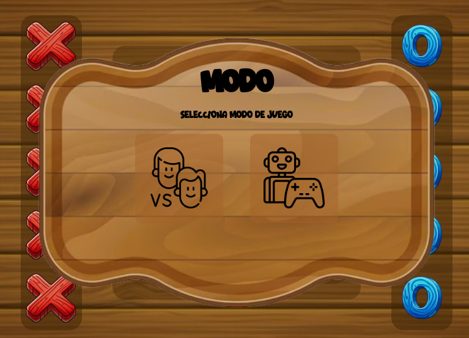
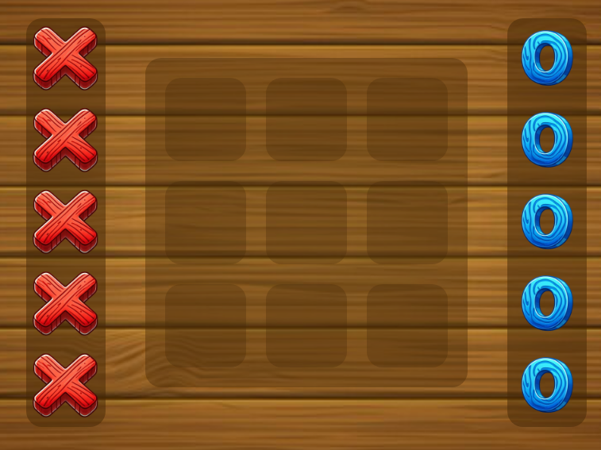

# 3 En Raya
## Jesús Pérez Enríquez

### Notas del desarrollo
Todo el código ha sido creado por mi. No he sacado nada de código de internet, IA, familiares o personas cercanas...

#### Ideas para el futuro del desarrollo:
*Estas ideas son ideas que iba a implementar pero por tema de tiempo no he podido terminar. El proyecto continuará de forma privada en desarrollo.*

* Añadir sonido al mivimiento de las fichas.
* Añadir animación al movimiento del BOT.
* Añadir un menú de personalización de las fichas.
* Añadir un modo Online.

### Guía de Usuario

> **1º Seleccionas modo de juego:**
> 
> 
> *Si quieres jugar contra la maquina, pulsa el botón de la derecha (Robot).*
  
>  *Si quieres jugar con otra persona desde el mismo ordenador, pulsa el botón de la izquierda (Personas).*

> **2º Juegas:**
>
> 
> Si estás jugando contra la IA, deberás arrastrar las ❎ al tablaro. (Una casilla que esté vacía).
  
> Si estás jugando con otra persona, deberás arrastrar las ❎ o los ⭕ dependiendo del turno. (A una casilla vacía)